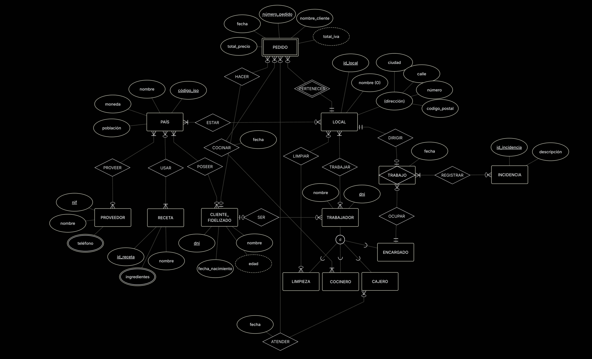

- `LOCAL.dirección` se indica como un atributo compuesto, ya que guarda partes de la dirección en subatributos.
- `LOCAL.nombre` se indica como un atributo opcional, ya que no todos los locales pueden tener nombre.
- `TRABAJADOR` es una generalización disjunta y parcial, debido a que pueden existir más tipos de trabajadores y solo un trabajador puede ejercer una única profesión. De él derivan subtipos como `COCINERO`.
- `ENCARGADO`, como subtipo de `TRABAJADOR`, debe registrar las incidencias ocurridas durante su trabajo en un local, por lo que se indica una agregación en la relación `TRABAJO`.
- `TRABAJADOR` y `CLIENTE_FIDELIZADO` van relacionados, ya que un trabajador puede ser también un cliente fidelizado y realizar pedidos en un local.
- `PEDIDO` es una entidad débil dependiente de `LOCAL`, y se modela mediante la relación identificadora `PERTENECER`, dado que un pedido no puede existir sin estar asociado a un local. Por ello, `PEDIDO.numero_pedido` es un identificador parcial dependiente de `LOCAL.id_local`.
- `PROVEEDOR.telefono` es un atributo multivaluado, ya que un proveedor puede disponer de varios números de teléfono.
- `CLIENTE_FIDELIZADO.edad` es un atributo derivado que se obtiene a partir de `CLIENTE_FIDELIZADO.fecha_nacimiento`.
- `COCINERO.cantPedidosR` y `CAJERO.cantPedidosA` son atributos derivados, obtenidos de otros datos y no se representan directamente en el modelo.

Puedes interactuar con el modelo utilizando **ERDPlus** https://erdplus.com.  
Solo tienes que abrir el archivo [`ModeloEER.erdplus`](ModeloEER.erdplus) y cargarlo en la herramienta para editar, visualizar o exportar el diagrama de manera dinámica.
