## MODELO ENTIDAD RELACIÓN EXTENDIDO

---

- `LOCAL.dirección` se indica como un atributo compuesto, ya que guarda partes de la dirección en subatributos.
- `LOCAL.nombre` se indica como un atributo opcional, ya que no todos los locales pueden tener nombre.
- `TRABAJADOR` es una generalización disjunta y parcial, debido a que pueden existir más tipos de trabajadores y solo un trabajador puede ejercer una única profesión. De él derivan subtipos como `COCINERO`.
- `ENCARGADO`, como subtipo de `TRABAJADOR`, debe registrar las incidencias ocurridas durante su trabajo en un local, por lo que se indica una agregación en la relación `TRABAJO`.
- `TRABAJADOR` y `CLIENTE_FIDELIZADO` van relacionados, ya que un trabajador puede ser también un cliente fidelizado y realizar pedidos en un local.
- `PEDIDO` es una entidad débil dependiente de `LOCAL`, y se modela mediante la relación identificadora `PERTENECER`, dado que un pedido no puede existir sin estar asociado a un local. Por ello, `PEDIDO.numero_pedido` es un identificador parcial dependiente de `LOCAL.id_local`.
- `PROVEEDOR.telefono` es un atributo multivaluado, ya que un proveedor puede disponer de varios números de teléfono.
- `CLIENTE_FIDELIZADO.edad` es un atributo derivado que se obtiene a partir de `CLIENTE_FIDELIZADO.fecha_nacimiento`.
- `PEDIDO.total_iva` procede de `PEDIDO.total_precio` por lo que el atributo es derivado y calculado de esta.

---  

Puedes interactuar con el modelo utilizando **ERDPlus** https://erdplus.com.  
Solo tienes que abrir el archivo [`ModeloEER.erdplus`](ModeloEER.erdplus) y cargarlo en la herramienta para editar, visualizar o exportar el diagrama de manera dinámica.  

---
    

## MODELO RELACIONAL

```mermaid
classDiagram
direction BT

class ATENDER {
   char(9) dniTrabajador
   int unsigned numPedido
   int unsigned idLocal
   datetime fecha
}
class CAJERO {
   char(9) dniTrabajador
}
class CLIENTE_FIDELIZADO {
   varchar(128) nombre
   date fecha_nacimiento
   int edad
   char(9) dni
}
class COCINAR {
   char(9) dniTrabajador
   int unsigned numPedido
   int unsigned idLocal
   datetime fecha
}
class COCINERO {
   char(9) dniTrabajador
}
class ENCARGADO {
   char(9) dniTrabajador
}
class ESTAR {
   int unsigned idLocal
   char(2) isoPais
}
class INCIDENCIA {
   text descripcion
   int unsigned id_incidencia
}
class INGREDIENTE {
   varchar(128) nombre
   int unsigned idReceta
}
class LIMPIAR {
   char(9) dniTrabajador
   int unsigned idLocal
}
class LIMPIEZA {
   char(9) dniTrabajador
}
class LOCAL {
   varchar(128) nombre
   varchar(64) ciudad
   varchar(64) calle
   varchar(8) numero
   char(5) codigo_postal
   int unsigned id_local
}
class PAIS {
   varchar(64) nombre
   char(3) moneda
   int poblacion
   char(2) codigo_iso
}
class PEDIDO {
   datetime fecha
   varchar(128) nombre_cliente
   char(9) dniCliente
   decimal(10,2) total_precio
   decimal(10,2) total_iva
   int unsigned numero_pedido
   int unsigned idLocal
}
class POSEER {
   char(9) dniCliente
   char(2) isoPais
}
class PROVEEDOR {
   varchar(128) nombre
   char(9) nif
}
class PROVEER {
   char(9) nifProveedor
   char(2) isoPais
}
class RECETA {
   varchar(64) nombre
   int unsigned id_receta
}
class REGISTRAR {
   int unsigned idLocal
   char(9) dniTrabajador
   int unsigned idIncidencia
}
class TELEFONO {
   char(9) nifProveedor
   varchar(16) numero
}
class TRABAJADOR {
   varchar(128) nombre
   char(9) dniCliente
   char(9) dni
}
class TRABAJAR {
   int unsigned idLocal
   char(9) dniTrabajador
}
class TRABAJO {
   datetime fecha
   int unsigned idLocal
   char(9) dniTrabajador
}
class USAR {
   int unsigned idReceta
   char(2) isoPais
}

ATENDER --> PEDIDO : numPedido,idLocal → numero_pedido,idLocal
ATENDER --> TRABAJADOR : dniTrabajador → dni

CAJERO --> TRABAJADOR : dniTrabajador → dni

COCINAR --> PEDIDO : numPedido,idLocal → numero_pedido,idLocal
COCINAR --> TRABAJADOR : dniTrabajador → dni

COCINERO --> TRABAJADOR : dniTrabajador → dni

ENCARGADO --> TRABAJADOR : dniTrabajador → dni

ESTAR --> LOCAL : idLocal → id_local
ESTAR --> PAIS : isoPais → codigo_iso

INGREDIENTE --> RECETA : idReceta → id_receta

LIMPIAR --> LOCAL : idLocal → id_local
LIMPIAR --> TRABAJADOR : dniTrabajador → dni

LIMPIEZA --> TRABAJADOR : dniTrabajador → dni

PEDIDO --> CLIENTE_FIDELIZADO : dniCliente → dni
PEDIDO --> LOCAL : idLocal → id_local

POSEER --> CLIENTE_FIDELIZADO : dniCliente → dni
POSEER --> PAIS : isoPais → codigo_iso

PROVEER --> PAIS : isoPais → codigo_iso
PROVEER --> PROVEEDOR : nifProveedor → nif

REGISTRAR --> INCIDENCIA : idIncidencia → id_incidencia
REGISTRAR --> TRABAJO : idLocal → idLocal
REGISTRAR --> TRABAJO : dniTrabajador → dniTrabajador

TELEFONO --> PROVEEDOR : nifProveedor → nif

TRABAJADOR --> CLIENTE_FIDELIZADO : dniCliente → dni

TRABAJAR --> LOCAL : idLocal → id_local
TRABAJAR --> TRABAJADOR : dniTrabajador → dni

TRABAJO --> ENCARGADO : dniTrabajador → dniTrabajador
TRABAJO --> LOCAL : idLocal → id_local

USAR --> PAIS : isoPais → codigo_iso
USAR --> RECETA : idReceta → id_receta
```

### PAIS (`codigo_iso`, `nombre`, `moneda`, `poblacion`)  
**PK:** (`codigo_iso`)

---  

### PROVEEDOR (`nif`, `nombre`)  
**PK:** (`nif`)

---  

### TELEFONO (`numero`, `nifProveedor*`)  
**PK:** (`numero`)  
**FK:** (`nifProveedor`) → PROVEEDOR

---  

### PROVEER (`nifProveedor*`, `isoPais*`)  
**PK:** (`nifProveedor`, `isoPais`)  
**FK:** (`nifProveedor`) → PROVEEDOR  
**FK:** (`isoPais`) → PAIS

---  

### RECETA (`id_receta`, `nombre`)  
**PK:** (`id_receta`)

---  

### INGREDIENTE (`nombre`, `idReceta*`)  
**PK:** (`nombre`, `idReceta`)  
**FK:** (`idReceta`) → RECETA

---  

### USAR (`idReceta*`, `isoPais*`)  
**PK:** (`idReceta`, `isoPais`)  
**FK:** (`idReceta`) → RECETA  
**FK:** (`isoPais`) → PAIS

---  

### CLIENTE_FIDELIZADO (`dni`, `nombre`, `fecha_nacimiento`, `edad`)  
**PK:** (`dni`)

---  

### POSEER (`dniCliente*`, `isoPais*`)  
**PK:** (`dniCliente`, `isoPais`)  
**FK:** (`dniCliente`) → CLIENTE_FIDELIZADO  
**FK:** (`isoPais`) → PAIS

---  

### LOCAL (`id_local`, `nombre`, `ciudad`, `calle`, `numero`, `codigo_postal`)  
**PK:** (`id_local`)

---  

### ESTAR (`idLocal*`, `isoPais*`)  
**PK:** (`idLocal`, `isoPais`)  
**FK:** (`idLocal`) → LOCAL  
**FK:** (`isoPais`) → PAIS

---  

### PEDIDO (`numero_pedido`, `idLocal*`, `fecha`, `nombre_cliente`, `dniCliente*`, `total_precio`, `total_iva`)  
**PK:** (`numero_pedido`, `idLocal`)  
**FK:** (`idLocal`) → LOCAL  
**FK:** (`dniCliente`) → CLIENTE_FIDELIZADO

---

### TRABAJADOR (`dni`, `nombre`, `dniCliente*`)  
**PK:** (`dni`)  
**FK:** (`dniCliente`) → CLIENTE_FIDELIZADO

---  

### TRABAJAR (`idLocal*`, `dniTrabajador*`)  
**PK:** (`idLocal`, `dniTrabajador`)  
**FK:** (`idLocal`) → LOCAL  
**FK:** (`dniTrabajador`) → TRABAJADOR

---  

### LIMPIEZA (`dniTrabajador*`)  
**PK:** (`dniTrabajador`)  
**FK:** (`dniTrabajador`) → TRABAJADOR

---  

### LIMPIAR (`dniTrabajador*`, `idLocal*`)  
**PK:** (`dniTrabajador`, `idLocal`)  
**FK:** (`dniTrabajador`) → TRABAJADOR  
**FK:** (`idLocal`) → LOCAL

---  

### COCINERO (`dniTrabajador*`)  
**PK:** (`dniTrabajador`)  
**FK:** (`dniTrabajador`) → TRABAJADOR

---  

### COCINAR (`dniTrabajador*`, `numPedido*`, `idLocal*`, `fecha`)  
**PK:** (`dniTrabajador`, `idLocal`, `numPedido`, `fecha`)  
**FK:** (`dniTrabajador`) → TRABAJADOR  
**FK:** (`numPedido`, `idLocal`) → PEDIDO

---  

### CAJERO (`dniTrabajador*`)  
**PK:** (`dniTrabajador`)  
**FK:** (`dniTrabajador`) → TRABAJADOR

---  

### ATENDER (`dniTrabajador*`, `numPedido*`, `idLocal*`, `fecha`)  
**PK:** (`dniTrabajador`, `idLocal`, `numPedido`, `fecha`)  
**FK:** (`dniTrabajador`) → TRABAJADOR  
**FK:** (`numPedido`, `idLocal`) → PEDIDO

---  

### ENCARGADO (`dniTrabajador*`)  
**PK:** (`dniTrabajador`)  
**FK:** (`dniTrabajador`) → TRABAJADOR

---  

### TRABAJO (`idLocal*`, `dniTrabajador*`, `fecha`)  
**PK:** (`idLocal`, `dniTrabajador`)  
**FK:** (`idLocal`) → LOCAL  
**FK:** (`dniTrabajador`) → ENCARGADO

---  

### INCIDENCIA (`id_incidencia`, `descripcion`)  
**PK:** (`id_incidencia`)

---  

### REGISTRAR (`idLocal*`, `dniTrabajador*`, `idIncidencia*`)  
**PK:** (`idLocal`, `dniTrabajador`, `idIncidencia`)  
**FK:** (`idIncidencia`) → INCIDENCIA  
**FK:** (`idLocal`) → TRABAJO  
**FK:** (`dniTrabajador`) → TRABAJO

---

Puedes interactuar con el modelo utilizando este enlace de [DBDiagram.io](https://dbdiagram.io/d/692a11abd6676488bad8b043)
